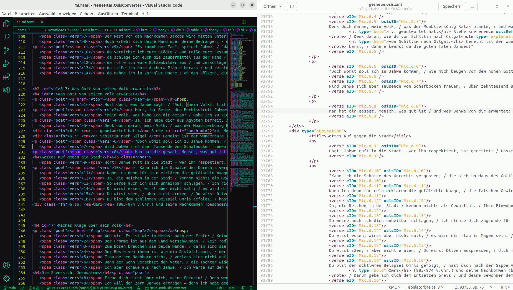
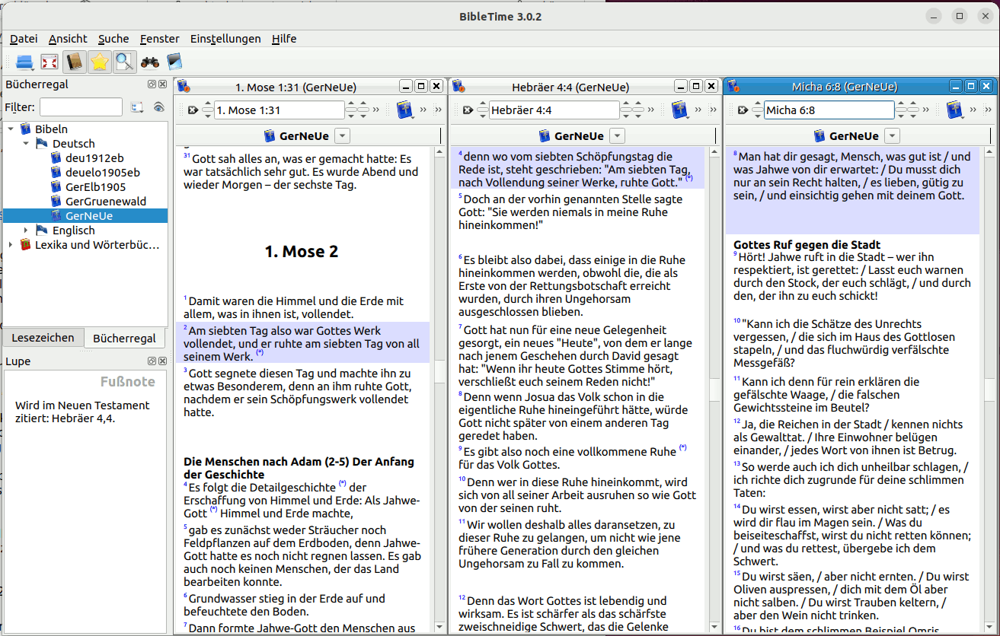

# NeueHtmlOsisConverter

FOSS program to convert *Neue evangelistische Übersetzung (NeÜ)* of the Bible to OSIS format. Input is HTML files of the Translator Mr. Vanheiden. Output is a single OSIS XML file used by Crosswire Bible Society's SWORD Project to provide the NeÜ Bible.

Licensed under GPLv3, built with dotnet 6.0 on Kubuntu 22.04.1, dotnet 7.0.114 on Kubuntu 23.10 and dotnet 8.0.108 on Fedora KDE 40

## Usage
Start the program with 2 command line parameters:
1. Path to HTML folder containing the NeÜ HTML files
2. Output file path

Example: <code>NeueHtmlOsisConverter /path/to/NeÜ gerneue.osis.xml</code>

## Links
- Online version of the NeÜ: [https://neue.derbibelvertrauen.de/](https://neue.derbibelvertrauen.de/)
- SWORD project: [https://www.crosswire.org/sword/](https://www.crosswire.org/sword/)
- OSIS format: [https://crosswire.org/osis/](https://crosswire.org/osis/)
- Program to read the NeÜ on Android devices: AndBible [https://andbible.github.io/](https://andbible.github.io/)
- Programs to read the NeÜ on Linux/Windows: 
  - Bibletime: [https://bibletime.info/](https://bibletime.info/), 
  - Xiphos: [https://xiphos.org/](https://xiphos.org/), 
  - Ezra: [https://ezrabibleapp.net/](https://ezrabibleapp.net/) 
  - and many more...

## Result

Input HTML file to the left, generated output on the right: 
gerneue module viewed in Bibletime: 

## Conversion to SWORD module

- The conversion to a SWORD module is done by the <code>osis2mod</code> tool. 
- It can be obtained by [different ways](https://wiki.crosswire.org/DevTools:Modules#Collect_and_Install_Software_Tools), e.g. by installing package <code>libsword-utils</code> by apt on Ubuntu or <code>sword-utils</code> by dnf on Fedora.
- Example: <code>osis2mod .sword/modules/texts/ztext/gerneue/ path/To/gerneue.osis.xml -v German -z z</code>. This will replace downloaded NeÜ SWORD texts by the new input from gerneue.osis.xml. (Before doing that, it is necessary to have downloaded the complete gerneue package from official channel once, so the NeÜ is accessible for SWORD apps.)